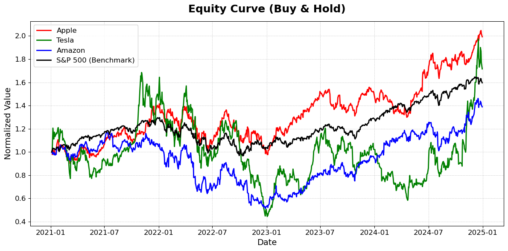

<!-- markdownlint-disable first-line-h1 -->
<!-- markdownlint-disable html -->
<!-- markdownlint-disable no-duplicate-header -->

  <h1>SmartStrategy</h1>

---

   <a href="mailto:erik.staszewski@gmail.com"><b>Email Me</b></a> | <a href="https://www.linkedin.com/in/estasz/"><b>My LinkedIn</b></a></b></a>

SmartStrategy is a quantitative trading framework that uses predictive modeling and signal-based logic to allocate capital among selected equities. The system uses individual LSTM models to forecast daily closing prices for Apple ($AAPL), Tesla ($TSLA), and Amazon ($AMZN), and uses directional predictions to guide the trades. Performance is benchmarked against the S&P 500 index.

  

## Overview

The dataset spans from 2019 to 2024, with financial data obtained via Yahoo Finance. The strategy was designed with a training window from 2019–2021 and a test window from 2021–2024.

Each stock is modeled independently using an LSTM neural network implemented in PyTorch, configured with SiLU activations and five fully connected layers. Training is done with Adam optimization, along with a learning rate scheduler and early stopping based on validation loss. A 60-day rolling window is used to predict next-day closing prices.

Model performance is evaluated using:
* Mean Absolute Error (MAE)
* Mean Absolute Percentage Error (MAPE)
* Directional Accuracy

## Model Performance (Individual Stocks)

| Ticker | Test MAE | Accuracy | Directional Accuracy |
| ------ | -------- | -------- | -------------------- |
| AAPL   | 0.0341   | 97.36%   | 49.85%               |
| TSLA   | 0.0564   | 94.50%   | 53.64%               |
| AMZN   | 0.0310   | 95.80%   | 49.15%               |

Each LSTM model is trained and evaluated separately. All models are optimized for out-of-sample generalization using dropout and early stopping.

## Strategy Logic

The strategy computes one-day-ahead predicted changes for each stock and derives a percentage-based signal. It selects the stock with the highest absolute predicted change to form a directional trade signal. To reduce noise and overtrading, signals are:

* Smoothed using a centered rolling mean
* Thresholded (±1%) to filter insignificant predictions
* Held for a fixed 5-day period, regardless of intermediate signal changes

The final position (long, short, or hold) determines which stock is held and for how long. Returns are calculated based on realized price changes during the holding period.

## Performance Summary

The table below compares SmartStrategy to a passive SPY buy-and-hold benchmark over the test period:

<table>
  <thead>
    <tr>
      <th>Strategy</th>
      <th>Total Return</th>
      <th>Annualized Return</th>
      <th>Sharpe Ratio</th>
    </tr>
  </thead>
  <tbody>
    <tr>
      <td><strong>SmartStrategy</strong></td>
      <td>5088.22%</td>
      <td>169.44%</td>
      <td>2.26</td>
    </tr>
    <tr>
      <td>SPY (Buy &amp; Hold)</td>
      <td>59.62%</td>
      <td>12.45%</td>
      <td>0.73</td>
    </tr>
  </tbody>
</table>

A log-scaled equity curve visualization further illustrates the compounding advantage of SmartStrategy over the benchmark and the individual constituent stocks.

  

## Key Features

* Individual LSTM models trained separately for each stock
* Signal-based asset selection based on model-predicted returns
* Smoothing and threshold filtering to reduce noise
* Fixed holding period for trade execution
* Backtested portfolio returns with Sharpe ratio evaluation
* Visual performance comparison against benchmarks

## Signal Utilization Statistics

Out of 1004 trading days in the test period:

| Signal Source   | Selections | Percentage (%) |
| --------------- | ---------- | -------------- |
| Tesla           | 630        | 45.16%         |
| Amazon          | 206        | 14.77%         |
| Apple           | 167        | 11.97%         |
| No Trade (Hold) | 392        | 28.10%         |

These figures reflect the distribution of trades initiated by the strategy based on model-generated signals.
