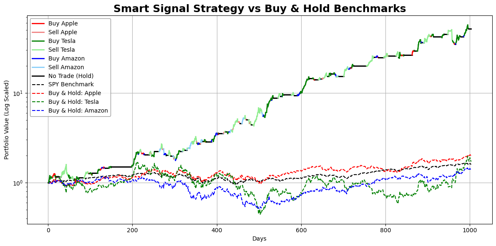

<!-- markdownlint-disable first-line-h1 -->
<!-- markdownlint-disable html -->
<!-- markdownlint-disable no-duplicate-header -->

  <h1>SmartStrategy</h1>

---

   <a href="mailto:erik.staszewski@gmail.com"><b>Email Me</b></a> | <a href="https://www.linkedin.com/in/estasz/"><b>My LinkedIn</b></a></b></a>

This project, SmartStrategy, supports quantitative trading with a signal-driven method. The strategy uses stocks like Apple, Amazon, and Tesla.

## Overview

Apple, Amazon, and Tesla were specifically selected due to their normalized start-to-end performance being similar to the S&P 500 benchmark during the testing window period of 2021 to 2024. The dataset spans from 2019 to 2024, with a training window covering 2019 to 2021 and a test window from 2021 to 2024. All financial data was sourced from Yahoo Finance. The predictive model employed is an LSTM implemented in PyTorch, using SiLU activations and multi-layer fully connected heads. Optimization was performed using the Adam optimizer, enhanced with a learning rate scheduler and early stopping. Model performance was evaluated using MAE, MAPE, and directional accuracy.

  

## Model Highlights

* Separate LSTM models are trained for each stock.
* Model predicts next-day closing prices based on a 60-day rolling window.
* Achieves high test accuracy:
  * Apple: 97.36%
  * Tesla: 94.50%
  * Amazon: 95.80%

## Strategy Logic

The strategy evaluates the predicted percentage change across all stocks and identifies the one with the strongest signal, whether upward or downward. To mitigate noise, smoothing techniques and signal thresholds are applied before any trading decisions are made. Trades are executed using fixed holding periods, and returns are compounded based on the directional accuracy of the model's predictions.

## Performance Summary

The plot below shows the returns log-scaled. As can be seen, the SmartStrategy quickly outperforms the S&P 500 benchmark as well as each individual stock. The results accumulate into a significantly larger profit over the course of 4 years.

  

<table>
  <thead>
    <tr>
      <th>Strategy</th>
      <th>Total Return</th>
      <th>Annualized Return</th>
      <th>Sharpe Ratio</th>
    </tr>
  </thead>
  <tbody>
    <tr>
      <td><strong>SmartStrategy</strong></td>
      <td>5088.22%</td>
      <td>169.44%</td>
      <td>2.26</td>
    </tr>
    <tr>
      <td>SPY (Buy &amp; Hold)</td>
      <td>59.62%</td>
      <td>12.45%</td>
      <td>0.73</td>
    </tr>
  </tbody>
</table>

## Key Features

- Clean, normalized data processing
- Individual training + backtesting per stock
- Aggregated strategy selects best-performing signals
- Visual comparison of predicted vs actual prices
- Equity curve and portfolio growth visualization
- Comparison to buy-and-hold benchmarks
